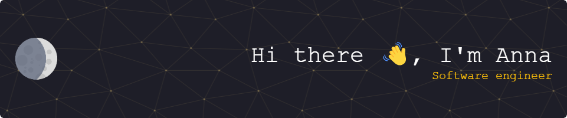

  
 
- 🌱 I’m currently learning **Flutter, React**
- 👨‍💻 All of my projects are available
[here](https://github.com/lumoswitch?tab=repositories)
- 🎓 I have a bachelor in **Computer Science**

## 🤝🏼 Connect with me:

 

## ⛏️ Languages and Tools: 
       
Programming Languages 
 

    
Frontend Development

 

Mobile App Development

 
    

Other

 
    
    
    
    
    
    

## 💹 Stats:

 

